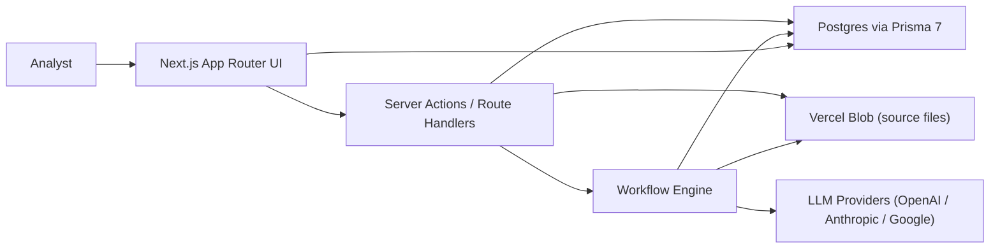
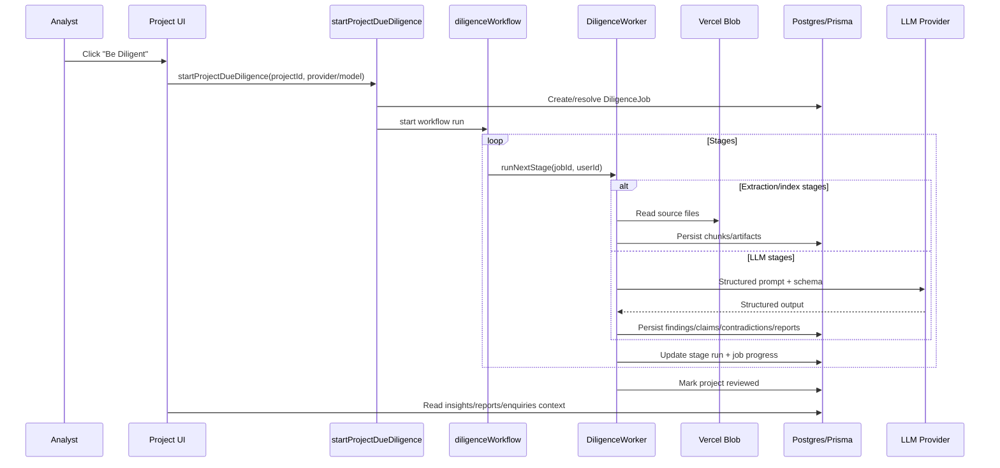

## Purpose

This document explains how `KG Qualify` is structured end-to-end, from user actions in the UI to persistence and LLM-backed diligence outputs.

## High-Level System

## Runtime Components

- `app/`: Next.js App Router pages and route handlers.
- `components/`: shared UI components.
- `lib/actions/`: server actions for project lifecycle, diligence execution, settings, and enquiries.
- `lib/diligence/`: staged diligence workflow, extraction, prompt plans, provider routing, corroboration logic.
- `lib/models/`: database access layer over Prisma models.
- `prisma/models/`: multi-file Prisma schema.
- `labels/`: typed localization labels used by UI routes/components.

## Main User Journeys

### 1) Project + document ingestion

- Project creation route: `app/(app)/projects/new/page.tsx`.
- Document APIs:  
  - `app/api/projects/[projectId]/documents/route.ts`  
  - `app/api/projects/[projectId]/documents/[...documentPath]/route.ts`
- Document storage model sync: `lib/models/ProjectDocumentModel.ts`.

### 2) Due diligence execution

- Triggered from project workspace UI: `app/(app)/project/[id]/ProjectDocumentsPanel.tsx`.
- Server action entry point: `lib/actions/project.ts` (`startProjectDueDiligence`, `retryProjectDueDiligence`, `cancelProjectDueDiligence`).
- Workflow orchestration: `lib/diligence/diligence-workflow.ts`.
- Stage executor: `lib/diligence/diligence-worker.ts`.

### 3) Analyst outputs

- Insights page: `app/(app)/project/[id]/insights`.
- Report listing and detail: `app/(app)/project/[id]/report`.
- Enquiries chat experience: `app/(app)/project/[id]/enquiries`.
- Enquiry answer generation (grounded context + citations): `lib/actions/enquiries.ts`.

## Diligence Pipeline Stages

The workflow stage sequence is defined in `lib/diligence/stages.ts`:

1. `DOCUMENT_EXTRACTION`
2. `DOCUMENT_CLASSIFICATION`
3. `EVIDENCE_INDEXING`
4. `ENTITY_EXTRACTION`
5. `CLAIM_EXTRACTION`
6. `CORROBORATION`
7. `Q1_IDENTITY_AND_OWNERSHIP`
8. `Q2_PRODUCT_AND_TECHNOLOGY`
9. `Q3_MARKET_AND_TRACTION`
10. `Q4_EXECUTION_CAPABILITY`
11. `Q5_BUSINESS_MODEL_VIABILITY`
12. `Q6_RISK_ANALYSIS`
13. `Q7_EVIDENCE_QUALITY`
14. `Q8_FAILURE_MODES_AND_FRAGILITY`
15. `OPEN_QUESTIONS`
16. `EXECUTIVE_SUMMARY`
17. `FINAL_REPORT`

## Data + Control Flow (Diligence)

## Model Provider Strategy

- User-configured keys are stored encrypted (`UserApiKey`).
- Routing logic selects primary and optional fallback providers (`lib/diligence/model-router.ts`).
- Provider abstraction is implemented in `lib/diligence/model-provider.ts`.
- LLM invocation + schema parsing is centralized in `lib/diligence/diligence-llm-service.ts`.

## Security and Access Patterns

- Every project-scoped query filters by `userId`.
- Child diligence tables intentionally include `userId` for direct row-level filtering without joins.
- Auth session is JWT-based via Auth.js (`lib/auth.ts`, `lib/auth.config.ts`).
- Uploaded source docs are private objects in Vercel Blob and accessed through authenticated route handlers.

## Notes for Extension

- Add OCR support for scanned PDFs in `lib/diligence/document-extractors.ts`.
- Add artifact materialization for `EVIDENCE_MAP` / `EXPORT_BUNDLE` types (currently report artifacts are generated).
- Extend enquiries retrieval/ranking strategies in `lib/actions/enquiries.ts`.
