## Prisma Setup

This project uses Prisma 7 with the `prisma-client` generator and a multi-file schema:

- Root config: `prisma/schema.prisma` (generator + datasource)
- Domain models: `prisma/models/*.prisma`
- Runtime client output: `lib/generated/prisma/`

Database access is centralized through `lib/db.ts` using `PrismaPg` adapter.

## Schema Domains

### 1) Identity + Auth

From `prisma/models/user.prisma` and `prisma/models/auth.prisma`:

- `User`
- `Account`
- `Session`
- `VerificationToken`
- enum `SystemRole` (`ADMIN`, `USER`)

Key points:
- `User.email` is unique.
- `User.password` is nullable to support OAuth-only users.
- `User.locale` defaults to `"en"`.
- `User.systemRole` controls platform-level admin access.
- `User.notificationPreferences` stores opt-in preferences as JSON.
- `Account` enforces `@@unique([provider, providerAccountId])`.
- `Session.sessionToken` is unique.
- `VerificationToken` enforces `@@unique([identifier, token])`.

### 2) Firms + Memberships

From `prisma/models/firm.prisma`:

- `Firm`
- `FirmMembership`
- `FirmInvitation`
- enums `FirmRole`, `FirmMembershipStatus`

Key points:
- `Firm` is the primary tenant boundary. All billing, projects, and access are scoped to a firm.
- `Firm.slug` is unique (used in URLs).
- `FirmMembership` enforces `@@unique([firmId, userId])`.
- Roles: `OWNER`, `ADMIN`, `PARTNER`, `ANALYST`, `REVIEWER`, `VIEWER`.
- `FirmInvitation` supports inviting users by email before they register. Token-based acceptance.
- Cascade delete removes memberships and invitations when a firm is deleted.

### 3) Project Workspace

From `prisma/models/project.prisma` and `prisma/models/project-document.prisma`:

- `Project`
- `ProjectDocument`
- `ProjectMembership`
- enums `ProjectStatus`, `ProjectDocumentProcessingStatus`

Key points:
- `Project` belongs to one `User` and one `Firm`.
- `Project.status` is one of `DRAFT`, `IN_PROGRESS`, `REVIEWED`, `COMPLETE`, `REJECTED`.
- `ProjectMembership` provides optional ring-fencing — when present, only listed members can access the project.
- `ProjectDocument` stores file metadata/pathname and processing state.
- `ProjectDocument.processingStatus` is one of `QUEUED`, `PROCESSING`, `PROCESSED`, `FAILED`.
- Cascade delete removes project children when a project is deleted.
- `ProjectDocument` enforces `@@unique([projectId, pathname])`.

### 4) API Key Management

From `prisma/models/api-key.prisma`:

- `UserApiKey`
- enum `ApiKeyProvider` (`OPENAI`, `ANTHROPIC`, `GOOGLE`)

Key points:
- One key per provider per user via `@@unique([userId, provider])`.
- `enabled` allows a key to be disabled without deletion.
- Validation state is captured with `lastValidatedAt` and `validationError`.

### 5) Diligence Execution and Outputs

From `prisma/models/diligence.prisma`:

- Execution control:
  - `DiligenceJob`
  - `DiligenceStageRun`
  - enums `DiligenceJobStatus`, `DiligenceStageName`, `DiligenceStageStatus`
- Input/output artifacts:
  - `DiligenceArtifact`
  - `DiligenceChunk`
  - enums `DiligenceArtifactType`, `DiligenceStorageProvider`
- Analytical entities:
  - `DiligenceEntity`
  - `DiligenceClaim`
  - `DiligenceFinding`
  - `DiligenceContradiction`
  - enums `DiligenceFindingType`, `DiligenceClaimStatus`
- Structured question framework:
  - `DiligenceQuestionAnswer`
  - `DiligenceEvidenceGap`
  - `DiligenceOpenQuestion`
  - `DiligenceDocumentClassification`
  - enum `DiligenceCoreQuestion`

Key points:
- `DiligenceJob` stores provider/model selection, fallback providers, workflow run ID, token usage, and estimated cost.
- `DiligenceArtifact` supports multiple storage backends and artifact types including `OCR_OUTPUT`, `MODEL_TRACE`, `EVIDENCE_MAP`, and `EXPORT_BUNDLE`.
- `DiligenceQuestionAnswer` enforces `@@unique([jobId, question])`.
- `DiligenceDocumentClassification` enforces `@@unique([jobId, documentPathname])`.

### 6) Knowledge Graph Definitions

From `prisma/models/graph.prisma`:

- `KnowledgeGraphDefinition`
- `OntologyNode`
- `OntologyEdge`
- `FirmGraphEnablement`
- `AssistanceGoal`
- `EvidenceRequirement`
- `EvidenceMapping`
- `OutputTemplate`
- enums `GraphDefinitionStatus`, `OntologyNodeKind`, `OntologyEdgeKind`, `EvidenceRequirementStatus`, `OutputTemplateKind`

Key points:
- `KnowledgeGraphDefinition` is platform-level and versioned. Slug is unique.
- `OntologyNode` kinds: `ENTITY`, `CONTROL`, `EVIDENCE_TYPE`, `QUESTION`, `OUTPUT_SECTION`, `RISK_CATEGORY`.
- `OntologyEdge` kinds: `REQUIRES`, `SATISFIES`, `CONTRADICTS`, `MAPS_TO`, `ESCALATES_TO`, `PART_OF`.
- `FirmGraphEnablement` links a firm to a published graph (`@@unique([firmId, graphId])`).
- `AssistanceGoal` binds a project to a graph (`projectId` is unique — one goal per project).
- `EvidenceRequirement` defines what each graph node needs to be satisfied.
- `EvidenceMapping` tracks per-project evidence status against requirements (`@@unique([projectId, requirementId])`).
- `OutputTemplate` defines report/questionnaire schemas per graph.

### 7) Billing + Entitlements

From `prisma/models/billing.prisma`:

- `BillingCustomer`
- `Subscription`
- `PlanEntitlement`
- `UsageMeter`
- `InvoiceEvent`
- enums `SubscriptionStatus`, `BillingInterval`

Key points:
- `BillingCustomer` is 1:1 with `Firm` (unique `firmId` and `stripeCustomerId`).
- `Subscription` tracks Stripe subscription state, period, and cancellation.
- `PlanEntitlement` defines per-firm limits (seats, projects, uploads, runs, exports).
- `UsageMeter` tracks rolling monthly usage counters, reset each billing period.
- `InvoiceEvent` is an immutable log of Stripe webhook events (idempotent via `stripeEventId`).

### 8) Audit Logs

From `prisma/models/audit.prisma`:

- `AuditLog`
- enum `AuditAction`

Key points:
- Scoped to `firmId` with optional `projectId`.
- `actorUserId` records who performed the action.
- Actions cover: membership, billing, project lifecycle, documents, workflows, exports, graph enablement.
- Indexed by `[firmId, createdAt]`, `[actorUserId, createdAt]`, `[projectId, createdAt]`, `[action, createdAt]`.

## Entity Relationship Overview

```mermaid
erDiagram
  User ||--o{ FirmMembership : "belongs to firms"
  Firm ||--o{ FirmMembership : "has members"
  Firm ||--o{ Project : "owns"
  Firm ||--o{ AuditLog : "tracks"
  Firm ||--|| BillingCustomer : "billed via"
  Firm ||--o| PlanEntitlement : "limited by"
  Firm ||--o| UsageMeter : "metered"
  Firm ||--o{ FirmGraphEnablement : "enables graphs"

  User ||--o{ Project : "creates"
  User ||--o{ UserApiKey : "configures"
  User ||--o{ DiligenceJob : "runs"

  Project ||--o{ ProjectDocument : "contains"
  Project ||--o{ DiligenceJob : "executes"
  Project ||--o| AssistanceGoal : "bound to graph"
  Project ||--o{ EvidenceMapping : "maps evidence"
  Project ||--o{ ProjectMembership : "ring-fenced by"

  KnowledgeGraphDefinition ||--o{ OntologyNode : "defines"
  KnowledgeGraphDefinition ||--o{ OntologyEdge : "connects"
  KnowledgeGraphDefinition ||--o{ EvidenceRequirement : "requires"
  KnowledgeGraphDefinition ||--o{ OutputTemplate : "outputs"
  KnowledgeGraphDefinition ||--o{ FirmGraphEnablement : "enabled for"
  KnowledgeGraphDefinition ||--o{ AssistanceGoal : "used by"

  DiligenceJob ||--o{ DiligenceStageRun : "tracks"
  DiligenceJob ||--o{ DiligenceArtifact : "emits"
  DiligenceJob ||--o{ DiligenceChunk : "indexes"
  DiligenceJob ||--o{ DiligenceEntity : "extracts"
  DiligenceJob ||--o{ DiligenceClaim : "extracts"
  DiligenceJob ||--o{ DiligenceFinding : "identifies"
  DiligenceJob ||--o{ DiligenceContradiction : "detects"
  DiligenceJob ||--o{ DiligenceQuestionAnswer : "answers"
  DiligenceJob ||--o{ DiligenceEvidenceGap : "records"
  DiligenceJob ||--o{ DiligenceOpenQuestion : "proposes"
  DiligenceJob ||--o{ DiligenceDocumentClassification : "classifies"

  BillingCustomer ||--o| Subscription : "subscribes"
```



## Design Decisions

- `userId` is duplicated across child diligence tables intentionally — allows direct row-level filtering by user without mandatory joins through `Project`/`DiligenceJob`.
- `firmId` on `Project` and `EvidenceMapping` enables firm-scoped queries without joining through user memberships.
- JSON fields are used for opaque structured outputs and references: `metadata`, `chunkRefs`, `evidenceRefs`, `structured`, `outputJson`, `topicsCovered`, `contradictions`, `fallbackProviders`.
- Heavy text (`DiligenceChunk.text`) and outputs are stored in DB for deterministic replay and enquiry grounding.
- Per-job uniqueness constraints keep stage outputs, question answers, and document classifications deterministic.
- `InvoiceEvent.stripeEventId` provides idempotency for webhook processing.

## Migration / Generate Commands

After changing schema files:

```bash
yarn prisma generate
yarn prisma migrate dev
```
