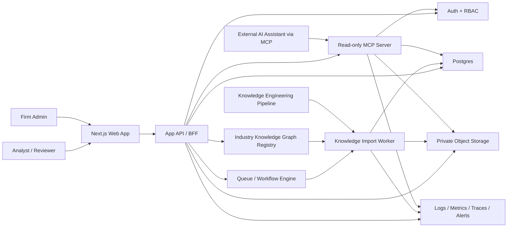
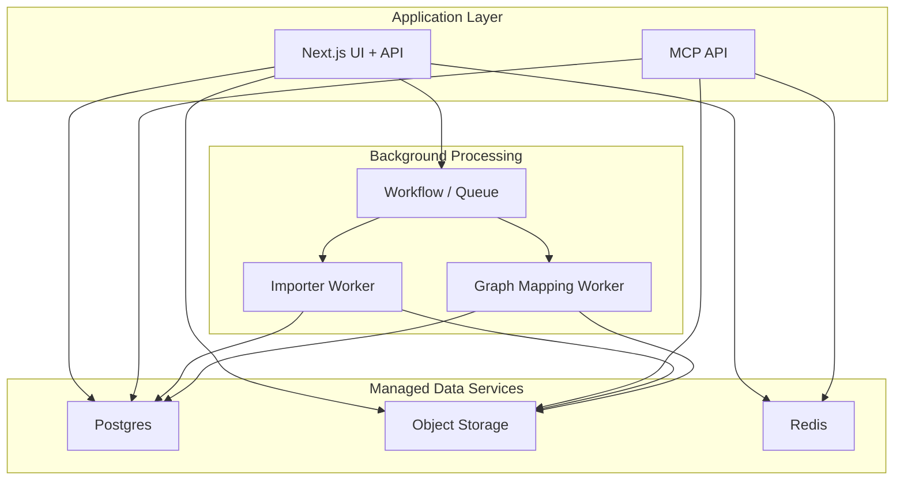

## Context

This document describes how I would take the current `KG Qualify` Stage 2 prototype to a production-ready knowledge graph platform for multiple firms, multiple concurrent deals or regulated workflows, and multiple contributors per firm.

The current prototype already has the right core shape:

- a Next.js application for the analyst workspace
- a Postgres-backed domain model
- object storage for source documents
- an asynchronous diligence workflow
- structured outputs such as claims, findings, contradictions, evidence gaps, forms, reports, and enquiries

For production, I would keep those foundations, but I would change the trust boundaries and data model. The most important shift is that the app should stop acting like a single-user diligence runner and start acting like a multi-tenant system of record for firms, deals, evidence, analyst positions, and imported structured intelligence.

## Design Principles

1. Protect tenant isolation before adding product breadth.
2. Keep the application authoritative for access control, auditability, and analyst workflow.
3. Treat the knowledge-engineering pipeline as a versioned upstream producer, not as logic embedded in the request path.
4. Prefer managed infrastructure and operational simplicity over bespoke distributed systems.
5. Preserve provenance everywhere so every conclusion can be traced back to source evidence.

## What I Would Keep vs Change

### Keep from Stage 2

- Next.js App Router UI and server-driven data fetching
- Postgres + Prisma as the primary system of record
- object storage for uploaded documents and derived artifacts
- asynchronous workflow execution for long-running tasks
- the staged analytical model: chunks, claims, findings, contradictions, reports

### Change for production

- move from `User -> Project` ownership to `Firm -> Deal -> Membership` access control
- separate document ingestion from structured-intelligence import
- add a read-only integration surface for MCP and external assistants
- enforce tenant isolation in both application code and the database
- introduce audit logging, observability, and operational controls expected by PE firms

## Proposed High-Level Architecture

## Data Model Evolution

The current schema is already close to a usable production core, but it is single-tenant. I would evolve it by introducing firm and deal boundaries explicitly while keeping the existing diligence tables where possible.

### Core tenancy model

Add these top-level entities:

- `Firm`
  - legal/customer boundary
  - billing, plan, region, data-retention policy
- `FirmMembership`
  - user-to-firm relationship
  - role such as `ADMIN`, `PARTNER`, `ANALYST`, `VIEWER`
- `Deal`
  - scoped to a single firm
  - effectively the production successor to `Project`
- `DealMembership`
  - optional per-deal restriction layer
  - supports private or ring-fenced deals inside a firm

In practice, I would likely keep the current `Project` table initially and add `firmId` plus membership tables rather than doing an immediate rename to `Deal`. That keeps migration risk low while moving the model in the right direction.

### Source and ingestion model

The current `ProjectDocument` model should evolve into a broader `SourceDocument` concept with:

- `firmId`
- `dealId`
- `uploadedByUserId`
- `sourceType` such as deck, transcript, CDD, call transcript, data room doc
- `storageKey`, checksum, MIME type, size, virus-scan status
- `ingestionStatus`
- `provenanceMetadata`

I would also add:

- `IngestionRun`
  - tracks an import from the upstream knowledge pipeline
  - includes pipeline version, ontology version, schema version, started/completed timestamps
- `KnowledgeSnapshot`
  - immutable imported intelligence package for a deal at a point in time
  - makes reprocessing and rollback tractable

### Analytical model

The current `Diligence*` tables are a good base and can mostly survive. I would extend them with `firmId` and versioning metadata, and I would add first-class analyst position objects:

- `Position`
  - a thesis, concern, or working conclusion
  - may be system-suggested or analyst-authored
- `PositionEvidence`
  - links a position to claims, findings, contradictions, or source passages
- `PositionRevision`
  - preserves the evolution of analyst judgment over time

This is the main conceptual gap between the current prototype and the Stage 3 brief. Today the prototype persists analytical outputs. In production, it should also persist the analyst’s evolving opinion graph.

### Firm-level intelligence boundary

I would explicitly separate confidential deal data from reusable firm-level learning.

- Deal-scoped layer:
  - raw documents
  - extracted passages
  - claims
  - findings
  - contradictions
  - analyst positions
- Firm-scoped derived layer:
  - aggregated patterns
  - source reliability signals
  - benchmark distributions
  - coverage heuristics

The critical rule is that firm-level intelligence should be derived from sanitized aggregates, not by exposing deal-level claims across engagements.

### Knowledge graph and assistance model

The product should make knowledge graphs first-class configuration, not hidden pipeline internals. Admins should be able to nominate or manage graph definitions for a firm, industry, standard, or workflow, and users should be able to select an assistance goal before uploading evidence.

I would add these concepts alongside the existing diligence model:

- `KnowledgeGraphDefinition`
  - versioned ontology for an industry, standard, or workflow
  - examples: SOC 2, ISO 27001, GDPR, vendor review, commercial due diligence
- `AssistanceGoal`
  - user-selected objective for a workspace
  - binds a project or deal to one graph definition and output workflow
- `EvidenceRequirement`
  - required control, question, claim, policy, contract term, or diligence item
- `EvidenceMapping`
  - links uploaded source passages, extracted claims, and analyst answers to graph requirements
- `OutputTemplate`
  - form, report, questionnaire, or review pack structure that can be drafted from mapped evidence

This shifts the platform from generic document analysis toward closed-loop knowledge gathering. The system should not just extract facts; it should know what the selected workflow requires, what evidence already satisfies those requirements, what is missing, and which output fields can be filled with provenance.

## Multi-Tenancy and Data Isolation

This is the area where I would invest earliest.

### Access model

Every request should resolve:

- authenticated user
- active firm context
- allowed deal set within that firm
- role and permissions

The application should never query by a bare record ID alone. Every read and write should be scoped by `firmId`, and deal-restricted objects should also be scoped by `dealId`.

### Authorization implementation contract

To make the access model real rather than aspirational, I would define an explicit runtime contract for how authorization context reaches the database.

- every request creates a `RequestContext` carrying:
  - `userId`
  - `firmId`
  - allowed `dealIds`
  - role set
  - request ID
- every database read/write flows through a small shared access layer rather than ad hoc Prisma calls in handlers
- every tenant-critical query executes inside a transaction that sets session-local database context such as:
  - `app.current_user_id`
  - `app.current_firm_id`
  - `app.allowed_deal_ids`
- RLS policies read from those session settings, so application scoping and database scoping agree on the same context
- background workers establish an explicit system actor plus tenant/deal scope for each job instead of bypassing policy with unrestricted database access

Concretely, I would treat direct unscoped ORM access as a production bug. The goal is not just “remember to filter by `firmId`,” but “make the safe path the default path.”

### Database enforcement

I would use two layers:

1. Application-level scoping in the model layer and API handlers.
2. Postgres row-level security for tenant-critical tables.

RLS matters here because the risk is not only external attackers. It also protects against accidental cross-tenant leakage caused by a missed filter in application code.

For example:

- session establishes `app.current_user_id` and `app.current_firm_id`
- policies allow access only to rows matching that firm
- deal-restricted tables additionally require membership in that deal

Prisma is not a substitute for this. Prisma helps ergonomics; RLS protects data.

### Storage isolation

Object storage should follow the same boundary:

- one private bucket per environment
- tenant/deal-prefixed keys such as `firm/{firmId}/deal/{dealId}/source/...`
- signed URLs generated only by authenticated backend code
- no public blobs

If customer requirements harden later, I would consider tenant-specific encryption keys, but I would not start there pre-seed unless a design partner requires it.

## Integration with the Knowledge-Engineering Pipeline

The brief says the knowledge engineer owns the extraction and structuring pipeline. I would reflect that directly in the architecture.

### Boundary decision

In production, the app should not be responsible for parsing raw documents into claims. It should be responsible for:

- accepting source uploads and metadata
- initiating or receiving processing requests
- importing structured outputs from the upstream pipeline
- presenting evidence-backed outputs to analysts

This is cleaner organizationally and technically. It lets the knowledge-engineering team iterate on ontologies and extraction logic without forcing app releases.

### Import contract

I would define a versioned import contract for each `KnowledgeSnapshot`:

- source document references and checksums
- claim records with provenance to exact passages
- ontology/entity mappings
- contradiction or convergence signals
- evidence gaps
- confidence values
- pipeline version metadata

Each import should be:

- immutable
- idempotent
- schema-versioned
- attributable to a specific pipeline run

### Imported intelligence vs analyst-authored state

The app should treat imported intelligence and analyst judgment as different layers with different mutation rules.

- `KnowledgeSnapshot` is immutable and represents what the upstream pipeline produced at a point in time
- `Position` and `PositionRevision` are analyst-facing opinion objects owned by the application
- positions should reference the snapshot, findings, claims, or passages they were derived from, but imported re-runs must not silently rewrite analyst-authored position history
- when a newer snapshot supersedes evidence, linked positions can be marked as `STALE`, `NEEDS_REVIEW`, or similar, but the original analyst judgment remains preserved
- system-suggested positions should be stored separately from analyst-confirmed positions so the UI can clearly distinguish machine proposal from human conclusion

This matters because analysts are not reviewing “the latest pipeline output” in the abstract. They are reviewing a specific evidence state and forming judgments that must remain auditable across reprocessing runs.

### Delivery mechanism

I would support either of these:

1. The app emits a job request and the pipeline calls back with results.
2. The pipeline emits events to a queue that the app importer consumes.

For an early-stage team, I prefer the second approach if the pipeline is already asynchronous. It is operationally simpler to make the importer retry-safe and let the queue handle backpressure.

### Why snapshots matter

Imported snapshots solve several production problems:

- analysts can see exactly which intelligence version they are reviewing
- re-runs do not mutate history invisibly
- bugs in the pipeline can be rolled back by marking a snapshot superseded
- external assistants can cite stable evidence identifiers

Another useful way to frame this is `Knowledge-Snapshot as Graph State`. In that model, each snapshot is not just a bag of extracted rows but an immutable, versioned graph of entities, claims, findings, contradictions, passages, and their provenance links at a specific point in time. The application can then let analyst-authored positions reference that graph state explicitly, compare one graph state to another across reprocessing runs, and mark downstream judgments stale without losing the original evidence context they were based on.

### Knowledge Snapshot as Graph State

A `KnowledgeSnapshot` should represent the graph state for a deal at a point in time, not just a bundle of extracted findings.

Each snapshot should include:

- ontology version
- extraction pipeline version
- entity IDs
- relationships
- claims
- supporting evidence
- contradictions
- unresolved gaps
- confidence scores
- superseded/changed graph elements from previous snapshots

This allows the platform to compare the current graph against previous snapshots and surface what has changed, what is stale, and what is contradicted by new evidence.

## MCP and External Integrations

The MCP server should not be a thin passthrough to internal tables. It should be a read-optimized, policy-aware integration surface.

### MCP design

- read-only by default
- explicit tools for:
  - list deals the caller can access
  - fetch positions and supporting evidence
  - retrieve source excerpts and citations
  - inspect evidence gaps and open questions
- every response includes provenance metadata
- tool access respects firm and deal permissions

I would keep the workspace API and the MCP API backed by the same authorization and domain services, but I would expose them through separate entry points. That reduces the chance of assistant-specific requirements leaking into the interactive product surface.

## Closed-Loop Knowledge Graph Workflows

The workflow expansion should focus on configurable knowledge graphs and evidence-backed assistance workflows.

### Admin graph setup

Admins should be able to nominate graph definitions for specific industries, standards, and review types. Each definition should describe:

- the ontology and vocabulary for the workflow
- required evidence and acceptable source types
- gap rules and reviewer escalation rules
- form fields, report sections, and export templates
- version history and migration rules for existing workspaces

Graph definitions should be firm-visible only when explicitly enabled for that firm. This preserves multi-tenant boundaries while still allowing the platform to maintain reusable graph templates.

### User workflow

Users should be able to:

1. create a workspace inside their firm
2. choose an assistance goal such as SOC 2, ISO 27001, GDPR, vendor review, or due diligence
3. upload documents and answer structured questions
4. run processing against the selected graph
5. review mapped evidence, missing requirements, and conflicts
6. generate forms, reports, questionnaires, or review packs with source citations

This gives the product a clear closed loop: define what the workflow needs, gather documents, map evidence, ask for missing information, and draft outputs for human review.

### Guardrails

The platform should remain assistive. It can prepare evidence-backed outputs and identify gaps, but final conclusions, regulatory submissions, and external representations should remain human-approved actions with audit logs.

## Infrastructure and Deployment

I would optimize for a small team that needs to move quickly without building a platform team too early.

### Recommended stack

- Web app and API:
  - Next.js deployed on Vercel or a small container platform
- Primary database:
  - managed Postgres
- Object storage:
  - S3 or equivalent private blob storage
- Queue/workflows:
  - keep the existing workflow engine for app-side orchestration
  - add a queue-backed importer for knowledge snapshots and graph-mapping tasks
- Cache and rate limiting:
  - Redis or managed equivalent
- Observability:
  - Sentry for errors
  - OpenTelemetry-compatible tracing
  - structured logs with request IDs and tenant context

### Early-stage deployment topology

### Reliability posture

At this stage I would deliberately accept:

- single region
- a single primary database
- managed backups rather than multi-region active-active
- modest queueing complexity instead of a large event mesh

I would not accept:

- no backups
- no audit trail
- no observability
- no retry/dead-letter strategy for imports
- no tenant-isolation enforcement beyond best-effort code filters

## Security Posture

For PE firms, credibility comes more from disciplined basics than from exotic security architecture.

### Priorities I would invest in early

1. Strong tenant isolation with database enforcement.
2. Private object storage and strict signed-access patterns.
3. MFA for internal users and support for SSO/SAML readiness.
4. Audit logs for document access, exports, assistant access, and role changes.
5. Secrets management and encrypted API keys.
6. Malware scanning and content-type validation for uploads.
7. Structured incident response, backups, and restore drills.

### Application security controls

- secure session management with short-lived sessions and rotation
- CSRF protection where required
- rate limiting on auth, upload, export, and MCP surfaces
- explicit service-to-service authentication for pipeline callbacks or import events
- role-based authorization at service boundaries, not only in the UI

### Data security controls

- encryption in transit and at rest
- environment-separated storage and databases
- retention and deletion policies by tenant
- immutable audit trail for privileged actions

### What I would defer

- customer-managed encryption keys
- full multi-region disaster recovery
- a highly customized SIEM program
- fine-grained attribute-based access control beyond firm/deal/role

Those may become necessary later, but they are not where I would spend pre-seed engineering cycles first.

## Operational Model

### CI/CD

- keep Vercel preview deployments and deployment CD for the web app
- add GitHub Actions for lint, typecheck, tests, and migration checks
- production deploys gated on green checks
- explicit Prisma migration review before production apply

### Observability

- request ID carried from UI to API to workers
- tenant/deal/job IDs included in logs
- metrics for:
  - import latency
  - workflow failures
  - MCP tool usage
  - document processing throughput
  - cost per deal

### Data operations

- daily backups with tested restore path
- soft-delete plus retention window for deals
- artifact checksum validation
- dead-letter queue for failed imports with replay tooling

## Phased Delivery Plan

### Phase 1: production baseline

- introduce `Firm`, `FirmMembership`, and deal-level permissions
- add `firmId` to tenant-critical tables
- establish a shared authorization/query layer so tenant scoping is the default path for every read and write
- enforce RLS
- move documents to private tenant-scoped object storage
- add integration tests that prove cross-tenant reads are rejected at both service and database layers
- add audit logs, Sentry, rate limiting, backups, and CI/CD

### Phase 2: pipeline hardening

- define the versioned knowledge snapshot contract
- build importer worker and idempotent import flow
- add snapshot history and reprocessing controls
- expose a read-only MCP surface

### Phase 3: workflow expansion

- first-class analyst positions and revision history
- admin-nominated industry and regulatory knowledge graphs
- user-selected assistance goals for SOC 2, ISO 27001, GDPR, vendor review, and due diligence
- evidence requirement mapping, gap follow-up, and output template generation
- firm-level aggregate intelligence layer
- more advanced assistant workflows grounded in firm-scoped graph state

## Key Trade-Offs

### Where I would cut corners

- keep a single relational database rather than splitting operational and analytical stores immediately
- keep one main region until customer or compliance pressure justifies more
- postpone autonomous regulatory submissions and external representations
- postpone deep microservice decomposition

### Where I would not cut corners

- tenant isolation
- provenance and snapshot versioning
- auditability
- secure storage boundaries
- retry-safe asynchronous ingestion

## Summary

The production version of the project development platform should remain a fairly simple system in structure:

- one core app
- one primary database
- one private object store
- one async processing plane
- one read-only external integration surface

The complexity should go into the right places: tenant isolation, evidence provenance, versioned graph definitions, versioned imports from the knowledge-engineering pipeline, and analyst trust in the outputs. That is the shortest path from the Stage 2 prototype to a platform that PE firms and regulated teams can actually use with sensitive workflow data.
